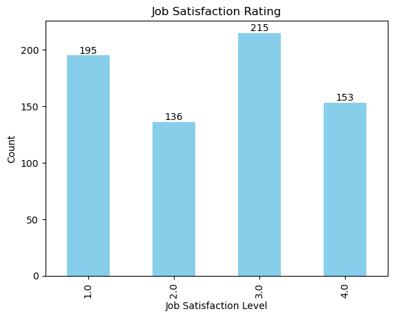
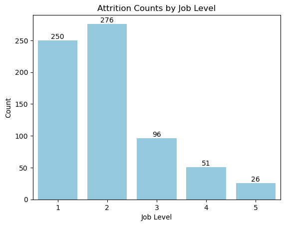

# Employee_Attrition_Analysis

## Project Background
Employee attrition is a significant concern for any company. Understanding the reasons behind why employees are leaving can help us develop effective strategies to retain our talent. This report analyzes various factors contributing to employee attrition and provides actionable insights to reduce the attrition rate.

Insights and recommendations are provided on the following key areas:

- **Job Satisfaction**:  Analysis of employee satisfaction levels and their impact on attrition rates.
- **Work-Life Balance Evaluation:**  Assessment of work-life balance ratings and their influence on employee well-being and retention.
- **Career Growth Patterns:**  Examination of promotion timelines in relation to employee tenure and its effect on long-term engagement.
- **Job Level and Attrition**: Analysis of which Job levels experiences the highest attrition.

The Jupyter Notebook used to inspect and clean the data for this analysis can be found here [link].

An interactive Tableau dashboard used to report and explore trends can be found here [link].

# Executive Summary

### Overview of Findings

The analysis reveals that job dissatisfaction, particularly around work-life balance and limited promotions, is linked to higher attrition. Employees with lower satisfaction ratings are more likely to leave, and most employees feel their work-life balance is moderate, not ideal. Additionally, a positive correlation between tenure and time since the last promotion suggests that long-serving employees may be experiencing slower career growth, which could further impact retention.

[Visualization, including a graph of overall trends or snapshot of a dashboard]

# Insights Deep Dive
### Job Satisfaction:

*  A total of 699 employees were surveyed for job satisfaction, with 215 employees rating their satisfaction as 3, which indicates a moderately low satisfaction level. This suggests a potential area for improvement in employee morale..
  
*  Of the 699 employees, 153 gave a rating of 4, indicating the lowest level of satisfaction. This group represents a critical concern, as they may be at higher risk of leaving due to dissatisfaction.
  
*  The highest satisfaction rating (1) was given by 195 employees, showing that only a small portion of the workforce is highly satisfied with their jobs, which indicates that overall job satisfaction across the company is skewed towards the lower end of the scale.
  

### Work-Life Balance:

* A total of 699 employees were surveyed regarding their work-life balance, with 377 employees rating it as 3. This rating suggests that a significant portion of the workforce perceives their work-life balance as below average. This moderate dissatisfaction indicates a potential area for improvement to enhance employee satisfaction and retention.
  
* Out of the 699 employees, 81 rated their work-life balance as 4, indicating the lowest level of satisfaction. This group represents a critical concern, as their dissatisfaction with work-life balance may correlate with higher attrition risk. Addressing their concerns could be crucial in reducing turnover rates.
  
* The highest rating for work-life balance (1) was given by 74 employees, showing that only a small portion of the workforce perceives their work-life balance as excellent. This skew towards lower ratings suggests that overall work-life balance across the company is perceived as suboptimal, and improving it could contribute to better employee morale and potentially reduce attrition.
  

### Career Growth Patterns::

* The moderate positive correlation (0.62) suggests that employees who have been at the company for a longer period are also likely to have gone longer without a promotion. This pattern may indicate that promotions are not consistently tied to tenure, possibly leading to frustration for long-serving employees who feel overlooked for advancement opportunities.
  
* As the correlation shows a tendency for longer tenure to coincide with longer gaps since the last promotion, this could signal a risk of career stagnation. Employees may perceive limited growth opportunities as they stay longer with the company, which could contribute to dissatisfaction and increased attrition rates, particularly for those who feel their efforts are not recognized or rewarded.

### Job Level and Attrition:

* The majority of attrition occurs in Job Levels 1 and 2, with 250 and 276 employees leaving, respectively. This suggests that lower-level positions experience higher turnover, potentially due to limited growth opportunities or lower satisfaction.
  
* Job Levels 3, 4, and 5 have significantly lower attrition rates, with only 96, 51, and 26 employees leaving, respectively. This could indicate that employees in higher-level positions are more likely to stay, possibly due to better compensation or job stability.
  
*  Combined, Job Levels 1 and 2 account for 75% of total attrition, signaling a need for targeted retention strategies focused on entry- and mid-level employees to address the disproportionately high turnover.

# Recommendations:

Based on the insights and findings above, we would recommend the [stakeholder team] to consider the following: 

* Specific observation that is related to a recommended action. **Recommendation or general guidance based on this observation.**
  
* Specific observation that is related to a recommended action. **Recommendation or general guidance based on this observation.**
  
* Specific observation that is related to a recommended action. **Recommendation or general guidance based on this observation.**
  
* Specific observation that is related to a recommended action. **Recommendation or general guidance based on this observation.**
  
* Specific observation that is related to a recommended action. **Recommendation or general guidance based on this observation.**
  

# Assumptions and Caveats:

Throughout the analysis, multiple assumptions were made to manage challenges with the data. These assumptions and caveats are noted below:

* Assumption 1 (ex: missing country records were for customers based in the US, and were re-coded to be US citizens)
  
* Assumption 1 (ex: data for December 2021 was missing - this was imputed using a combination of historical trends and December 2020 data)
  
* Assumption 1 (ex: because 3% of the refund date column contained non-sensical dates, these were excluded from the analysis)
